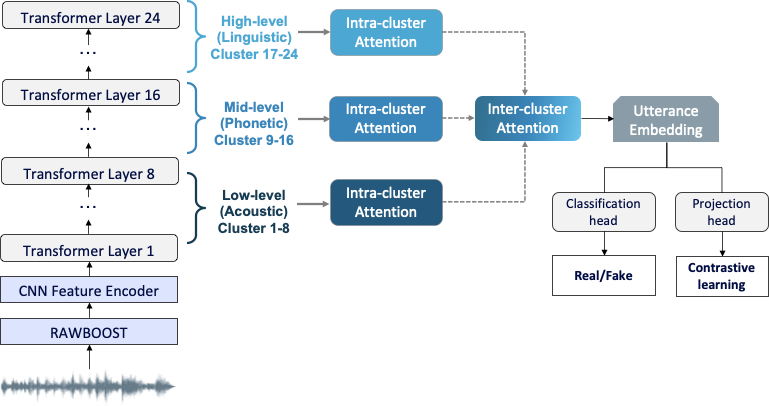

# <div align="center">HierCon: Hierarchical Contrastive Attention</br>for Audio Deepfake Detection</div>

### <div align="center">[Nicholas Liang](https://github.com/nicholas-liang), [Soyeon Caren Han](https://scholar.google.com/citations?user=VH2jVOgAAAAJ), Mike Wang, [Christopher Leckie](https://scholar.google.com/citations?user=0vPWOQcAAAAJ)</div>

#### <div align="center">Accepted at The Web Conference 2026 (WWW'26)<br>April 13-17, 2026 | Dubai, United Arab Emirates</div>

**Abstract:** Audio deepfakes generated by modern TTS and voice conversion systems are increasingly difficult to distinguish from real speech, raising serious risks for security and online trust. While state-of-the-art self-supervised models provide rich multi-layer representations, existing detectors treat layers independently and overlook temporal and hierarchical dependencies critical for identifying synthetic artefacts. We propose HierCon, a hierarchical layer attention framework combined with margin-based contrastive learning that models dependencies across temporal frames, neighbouring layers, and layer groups, while encouraging domain-invariant embeddings. Evaluated on ASVspoof 2021 DF and In-the-Wild datasets, our method achieves state-of-the-art performance (1.93% and 6.87% EER), improving over independent layer weighting by 36.6% and 22.5% respectively. The results and attention visualisations confirm that hierarchical modelling enhances generalisation to cross-domain generation techniques and recording conditions.

<p align="center">
  
</p>

---

## Key Features

- **Hierarchical Attention Framework**: Three-stage attention architecture modeling temporal, intra-group, and inter-group dependencies across XLS-R layers
- **Contrastive Learning**: Margin-based contrastive regularization for domain-invariant representations
- **State-of-the-Art Performance**: Achieves 1.93% EER on ASVspoof 2021 DF and 6.87% on In-the-Wild benchmarks
- **Interpretability**: Attention visualizations reveal which temporal frames and layer groups drive predictions

## Datasets

We evaluate HierCon on three benchmark datasets:

- **ASVspoof 2019 LA** (training): Logical access subset for training
- **ASVspoof 2021 LA** (evaluation): 148,176 utterances
- **ASVspoof 2021 DF** (evaluation): 533,928 utterances spanning over 100 deepfake generation pipelines
- **In-the-Wild (ITW)** (evaluation): 31,779 real-world samples

Please download the datasets from the [ASVspoof 2021 challenge](https://www.asvspoof.org/) and organize them according to the official structure.

## Installation

```bash
# Clone the repository
git clone https://github.com/yourusername/hiercon.git
cd hiercon

# Create conda environment
conda create -n hiercon python=3.8
conda activate hiercon

# Install dependencies
pip install -r requirements.txt
```

### Requirements

```
torch>=1.10.0
torchaudio>=0.10.0
transformers>=4.20.0
numpy>=1.21.0
scipy>=1.7.0
scikit-learn>=1.0.0
```

## Model Architecture

HierCon consists of three main components:

1. **XLS-R Feature Extraction**: Extracts 24-layer transformer representations from 4-second audio windows
2. **Hierarchical Attention Module**:
   - **Stage 1 - Temporal Attention**: Focuses on informative frames within each layer
   - **Stage 2 - Intra-Group Attention**: Captures dependencies among neighboring layers (8 groups × 3 layers)
   - **Stage 3 - Inter-Group Attention**: Integrates evidence across layer groups
3. **Contrastive Learning**: Margin-based loss enforcing geometric constraints on embeddings

## Training

### Basic Training

```bash
python main.py --database_path /path/to/database/ \
               --protocols_path /path/to/protocols/ \
               --track DF \
               --batch_size 16 \
               --num_epochs 50 \
               --lr 1e-6 \
               --contrastive_weight 0.1 \
               --contrastive_margin 0.5 \
               --group_size 3 \
               --comment "hiercon_baseline"
```

### Parameters

```
--database_path        Path to ASVspoof database directory
--protocols_path       Path to protocols directory
--track                Evaluation track: LA, DF, or In-the-Wild (default: DF)
--batch_size           Training batch size (default: 16)
--lr                   Learning rate (default: 1e-6)
--num_epochs           Number of training epochs (default: 50)
--contrastive_weight   Contrastive loss weight (default: 0.1)
--contrastive_margin   Contrastive margin (default: 0.5)
--group_size           Layers per group (default: 3)
--algo                 RawBoost algorithm (default: 3)
--seed                 Random seed for reproducibility (default: 1234)
--comment              Comment to describe the saved model
```

### Training with RawBoost Augmentation

RawBoost augmentation is applied by default using algorithm 3 (SSI_additive_noise). To change:

```bash
# No augmentation
python main.py --database_path /path/to/database/ --protocols_path /path/to/protocols/ --algo 0

# Different algorithm (1-8)
python main.py --database_path /path/to/database/ --protocols_path /path/to/protocols/ --algo 1
```

## Evaluation

### Evaluate on Test Sets

```bash
# Evaluate on DF dataset
python main.py --database_path /path/to/database/ \
               --protocols_path /path/to/protocols/ \
               --track DF \
               --eval \
               --model_path ./models/best_model.pth \
               --eval_output ./scores/eval_scores.txt

# Evaluate on In-the-Wild dataset
python main.py --database_path /path/to/database/ \
               --protocols_path /path/to/protocols/ \
               --track In-the-Wild \
               --model_path ./models/best_model.pth \
               --eval_output ./scores/itw_scores.txt
```

Available tracks: `LA`, `DF`, `In-the-Wild`

### Reproduce Paper Results

Use the provided shell scripts:

```bash
# Training
bash train.sh

# Evaluation
bash evaluate.sh
```

## Results

### Overall Performance

| Model                      | 21 LA    | 21 DF    | ITW      |
| -------------------------- | -------- | -------- | -------- |
| Wav2Vec+AASIST             | 0.82     | 2.85     | -        |
| OCKD                       | 0.90     | 2.27     | 7.86     |
| XLS-R + SLS                | 3.88     | 2.09     | 8.87     |
| **XLS-R + HierCon (Ours)** | **2.46** | **1.93** | **6.87** |

_All results reported as Equal Error Rate (EER %) - lower is better_

### Ablation Study

| Configuration              | 21 LA    | 21 DF    | ITW      |
| -------------------------- | -------- | -------- | -------- |
| XLS-R + SLS (Baseline)     | 3.88     | 2.09     | 8.87     |
| + Hierarchical Attention   | 2.97     | 2.13     | 8.81     |
| + Hier. Attn + Contrastive | **2.46** | **1.93** | **6.87** |

### Attention Visualization

The hierarchical attention mechanism provides interpretability:

- **Temporal attention** concentrates on middle regions (40-70% duration)
- **Intra-group attention** shows adaptive layer selection across groups
- **Inter-group attention** reveals mid-level dominance (layers 12-14)

## Project Structure

```
HierCon/
├── models/
│   └── Hiercon.py           # HierCon model architecture
├── core_scripts/
│   └── startup_config.py    # Random seed and reproducibility
├── wav2vec/                 # XLS-R model utilities
├── data_utils_SSL.py        # Dataset loaders and augmentation
├── RawBoost.py              # RawBoost augmentation implementation
├── main.py                  # Training and evaluation script
├── train.sh                 # Training script
├── evaluate.sh              # Evaluation script
├── requirements.txt
└── README.md
```

## Citation

```bibtex
@inproceedings{liang2026hiercon,
    author = {Liang, Nicholas and Han, Soyeon Caren and Wang, Mike and Leckie, Christopher},
    title = {HierCon: Hierarchical Contrastive Attention for Audio Deepfake Detection},
    year = {2026},
    publisher = {Association for Computing Machinery},
    address = {New York, NY, USA},
    url = {https://doi.org/10.1145/3774904.3792873},
    doi = {10.1145/3774904.3792873},
    booktitle = {Proceedings of the ACM on Web Conference 2026},
    location = {Dubai, United Arab Emirates},
    series = {WWW '26}
}
```

## Acknowledgments

This research was supported by:

- Korea Planning & Evaluation Institute of Industrial Technology (KEIT) funded by the Ministry of Trade, Industry and Energy (No.RS-2025-25458052, Development of Core Technologies for Manufacturing Foundation Models)
- Institute of Information & communications Technology Planning & Evaluation (IITP) grant funded by the Korea government(MSIT) (No.RS-2025-02217259, Development of self-evolving AI bias detection-correction-explain platform based on international multidisciplinary governance)

The ASVspoof 2019 dataset, which can can be downloaded from here.

The ASVspoof 2021 database is released on the zenodo site.

LA here

DF here

The In-the-Wild dataset can be downloaded from here

For ASVspoof 2021 dataset keys (labels) and metadata are available here

CUDA_VISIBLE_DEVICES=0 python main.py --track=DF --is_eval --eval
--model_path=/path/to/your/best_model.pth
--protocols_path=database/ASVspoof_DF_cm_protocols/ASVspoof2021.DF.cm.eval.trl.txt
--database_path=/path/to/your/ASVspoof2021_DF_eval/
--eval_output=/path/to/your/scores_DF.txt

CUDA_VISIBLE_DEVICES=0 python main.py --track=LA --is_eval --eval
--model_path=/path/to/your/best_model.pth
--protocols_path=database/ASVspoof_DF_cm_protocols/ASVspoof2021.LA.cm.eval.trl.txt
--database_path=/path/to/your/ASVspoof2021_LA_eval/
--eval_output=/path/to/your/scores_LA.txt

CUDA_VISIBLE_DEVICES=0 python main.py --track=In-the-Wild --is_eval --eval
--model_path=/path/to/your/best_model.pth
--protocols_path=database/ASVspoof_DF_cm_protocols/in_the_wild.eval.txt
--database_path=/path/to/your/release_in_the_wild/
--eval_output=/path/to/your/scores_In-the-Wild.txt

                                        python evaluate_2021_DF.py scores/scores_DF.txt ./keys eval

python evaluate_2021_LA.py scores/scores_LA.txt ./keys eval

python evaluate_in_the_wild.py scores/scores_Wild.txt ./keys eval
